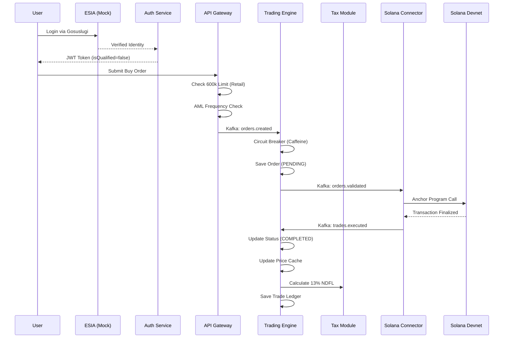

# PelluChain - DFA Trading Platform

PelluChain is a high-velocity Solana-based ecosystem for digital financial assets, delivering pellucid transparency and institutional-grade compliance through a unified, high-performance ledger.

  <video src="media/logo_anime.mp4" autoplay loop muted playsinline style="max-width: 100%;"></video>

## Architecture Overview

## Key Enterprise Features

1.  **State Identity Integration:** Mocked ESIA (Gosuslugi) flow for instant KYC.
2.  **Regulatory Limits:** Enforced 600,000 RUB annual limit for non-qualified investors.
3.  **Tax Automation:** Automatic calculation of 13% NDFL on successful exits.
4.  **High-Performance Engine:** Caffeine-based in-memory price tracking and sliding window volatility checks.
5.  **Corporate Actions:** Automated dividend payout engine integrated with Solana token transfers.
6.  **Full Observability:** Prometheus/Grafana monitoring with custom business metrics.
7.  **Admin Dashboard:** Centralized control for KYC, AML, and Corporate Actions.

## API Documentation
Interactive documentation (Swagger UI) is available at:
- Gateway: `http://localhost:8080/swagger-ui.html`
- Engine: `http://localhost:8081/swagger-ui.html`
- Auth: `http://localhost:8083/swagger-ui.html`
